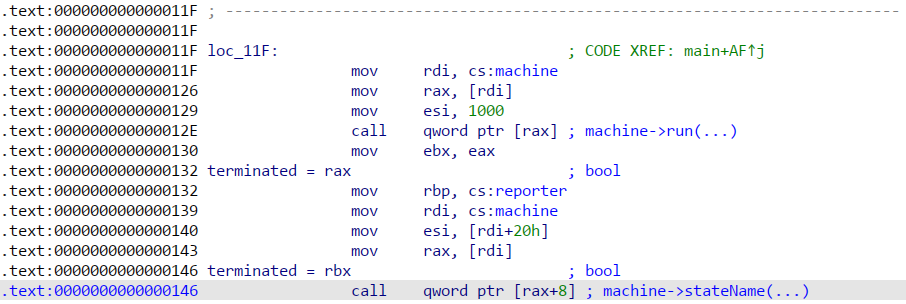

Demo Exploit
============

## Initial Vulnerability: C string parsing
C++ lexes "\x0001" as one byte, other languages don't. 
We can produce strings with different length in C++ and Go:
- Tape: `\x0000000000000000000000000000000000000000000000000000000000000000000000000000000000000000000000XYZ`
- Characters in Go: 96
- Characters in C: 4

We can create a Turing Machine operating on this tape, writing in the program's memory.

## Initial memory layout
```
HEAP:
     | ...           |
     |---------------|
0x00 | 00 X Y Z ...  | <tape>     5 bytes
     |---------------|
0x20 | &vtable       | <machine> 56 bytes
0x28 | tapeStart     |
0x30 | tapeEnd       |
0x38 | head          |
     | ...           |
0x48 | registers 0-7 |
0x50 | registers 8-f |
     |---------------| <-- head can go up to here (0x59)
0x60 | stdout        | <reporter> 8 bytes
     |---------------|
     | ...           |
     
vtable of TuringMachine:
     |-------------------|
0x00 | &::run(int)       | <-- &vtable points here
0x08 | &::stateName(int) |
     |-------------------|
```

## Exploit Overview
1. We overwrite tapeStart and tapeEnd to get infinite memory write
2. We overwrite the vtable pointer, pointing to our extended tape
3. We build a faked vtable before `tape`, pointing to some gadgets that invoke `system`. We use `stdout` in `reporter` for libc leak.
4. We store the payload in `reporter`
5. When the machine halts, and `stateName()` is invoked, the faked vtable is used, invoking our gadget chain

## Virtual Dispatch Disassembly
We modify memory during `machine->run()` (0x12E). 
Our modified vtable entries get invoked at `machine->stateName()` (0x146).
At this point, we have the address of `reporter` in `rbp` and the vtable address in `rax`.



We need a writeable address in `rdi` when we call `system`.
But rdi is overwritten with the vtable's address slot.
When looking through libc's gadgets, we find: `mov rdi, rbp ; call qword ptr [rax+0x20]`.
`rax` is still the vtable's address, so we get `reporter`'s address in rdi and then call vtable slot 0x20.
We can't use traditional `ret` gadgets because we have no control over the stack.
The additional call mis-alignes the stack with its return address, we use a second call gadget to fix this: `call qword ptr [rax+0x18]`.
In the vtable we fake, we will finally have the two gadgets and `system`'s address, we write our payload over `reporter` (which we don't need anymore).

Note: some compiler versions might omit this code with `rbx` instead of `rbp` here. 
This doesn't change the overall exploit, libc contains the same gadget with `rbx`. 

## Memory Layout after Turing Machine ran
It does not really matter where the faked vtable is placed, as long as we compute its offset relative to `machine->head`.
Our sample exploit places it before the tape, at `-0x30` - `-0x08`.
```
            | ...            |
            |----------------|
vtable 0x00 | ?              | <-- rax    <-- vtable
vtable 0x08 | gadget 1       | --> mov rdi, rbp ; call [rax+0x20]
vtable 0x10 | ?              |
vtable 0x18 | system         |
vtable 0x20 | gadget 2       | --> call [rax+0x18]
            |----------------|
     
            |----------------|
       0x00 | 00 X Y Z ...   | <tape>     5 bytes
            |----------------|
       0x20 | &"vtable 0x00" | <machine> 56 bytes  <-- rdi   --> vtable
       0x28 | 0x00000000     |  .tapeStart
       0x30 | 0xffffffff     |  .tapeEnd  
       0x38 |                |  .head
            | ...            |
       0x48 | &head          |  .registers 0-7
       0x50 | stdout         |  .registers 8-f
            |----------------|
       0x60 | "cat *.json"   | <payload>  <-- rbp
            |----------------|
            | ...            |
```
